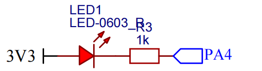
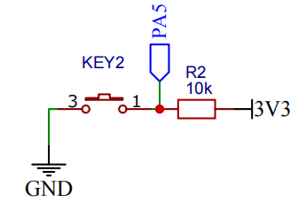
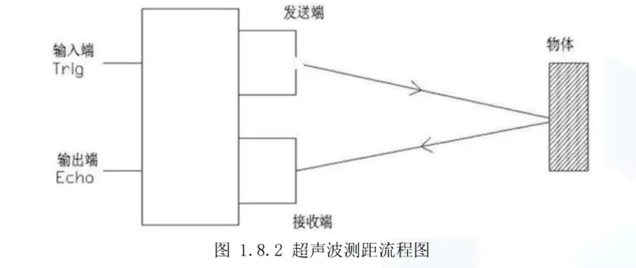
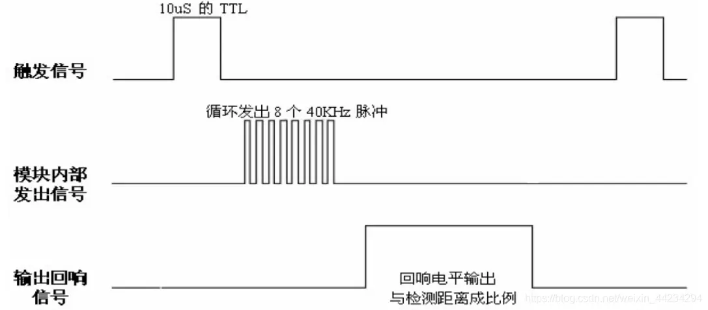
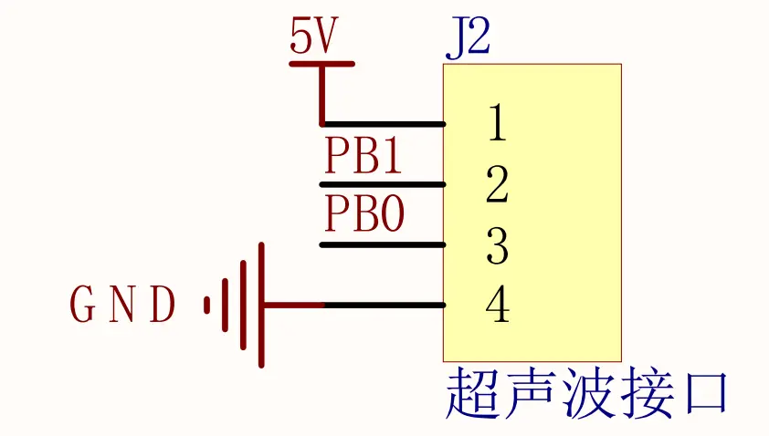

# 1 创建工程

使用 STM32CubeMX 创建一个 STM32F103C8T6 Makefile 工程, 添加一些基本文件, 例如 .clang-format, .gitignore, clang-format.py, build.sh 文件

- .clang-format 源码文件统一格式化规范
- build.sh 辅助编译脚本, 一键编译下载, openocd 下载调试
- .gitignore 版本管理文件
- clang-format.py 批量格式化源码脚本文件

# 2 外设模块驱动编写

## 2.1 串口

### 2.1.1 串口 IO 资源分配

| IO 名称 | 说明     |
| ------- | -------- |
| PA9     | USART_TX |
| PA10    | USART_RX |

### 2.1.2 串口配置

STM32CubeMX 的默认配置, 波特率: 115200, 数据位长度: 8, 无校验

### 2.1.3 串口 printf 重定义

```c
/* ANCHOR - gcc printf 重定义 */
# if3 /* printf 重定义 */
# 4 ifdef __GNUC__
# 5 define PUTCHAR_PROTOTYPE int __io_putchar(int ch)
# 6 else
# 7 define PUTCHAR_PROTOTYPE int fputc(int ch, FILE* f)
# 8 endif /* __GNUC__ */

PUTCHAR_PROTOTYPE
{
    /* 实现串口发送一个字节数据的函数 */
    while ((USART1->SR & 0x40) == 0)
    {
    }
    USART1->DR = (uint8_t)ch;
    return ch;
}

int _write(int file, char* ptr, int len)
{
    int DataIdx;
    for (DataIdx = 0; DataIdx < len; DataIdx++)
    {
        __io_putchar(*ptr++);
    }
    return len;
}
# 9 endif /* printf 重定义 */
```

注意: 上面的串口 printf 重定义是针对 GCC 编译器的, 并且上述的串口 printf 重定义无法输出浮点数, 为了输出浮点数还需要设置一个链接选项

打开 Makefile 文件, 然后做出以下修改:

```c
LDFLAGS = $(MCU) -specs=nano.specs -T $(LDSCRIPT) $ (LIBDIR) $(LIBS) -Wl,-Map=$(BUILD_DIR)/$(TARGET).map,--cref -Wl,--gc-sections
--> 在链接选项中增加 -u _printf_float, 添加后编译生成的文件增大 8KB
LDFLAGS = $(MCU) -specs=nano.specs -u _printf_float -T $(LDSCRIPT) $ (LIBDIR) $(LIBS) -Wl,-Map=$(BUILD_DIR)/$(TARGET).map,--cref -Wl,--gc-sections
```

## 2.2 LED

### 2.2.1 LED 原理图



原理图分析:

- 当 PA4 输出低电平的时候, LED 亮
- 当 PA4 输出高电平的时候, LED 灭
- 让 PA4 的初始状态为高电平

### 2.2.2 LED IO 资源分配

| IO 口 | 说明 |
| ----- | ---- |
| PA4   | LED  |

### 2.2.3 LED GPIO 口配置

推挽输出, 默认高电平 (LED 灭), 速率低

## 2.3 Key 按键

### 2.3.1 Key 按键原理图



原理图分析:

- 按键按下, PA5 为低电平
- 按键释放, PA5 为高电平

### 2.3.2 Key IO 资源分配

| IO 口 | 说明     |
| ----- | -------- |
| PA5   | 用户按键 |

### 2.3.3 Key GPIO 配置

浮空输入, 由于外部有上拉电阻存在, 所以默认 PA5 是高电平

### 2.3.4 按键扫描, 检测按键单击, 双击, 长按

为了不让按键影响其他任务的执行, 需要使用非阻塞的方式进行按键扫描

非阻塞有三种实现方式:

1. while(1) 循环作为时基 (受任务数量, 时基不确定)
2. 定时器作为时基, 使用周期性定时器中断来检测按键 (时基确定)
3. 按键外部中断触发, 定时器辅助

按键扫描有2种判断方式:

1. 状态机 (逻辑清晰)
2. 条件判断+标志位 (逻辑复杂, 需要很多条件判断和标志位变量)

选择**软件定时器+状态机**的组合: 详情请见源码

## 2.4 超声波 HC-SR04

### 2.4.1 HC-SR04 技术参数

- 2cm-450cm 测量范围, 超过或小于这个测量范围, 测量误差会变大

### 2.4.2 HC-SR04 工作原理



Trig 端发一个 10US 以上的高电平, 就可以在 Echo 口等待高电平输出, 一有输出就可以开定时器计时, 当此口变为低电平时就可以读定时器的值, 此时就为此次测距的时间, 方可算出距离, 如此不断的周期测, 即可以达到你移动测量的值



#### 定时器测量高电平时间的两种方式 (阻塞和非阻塞)

**方式 1:** 出现上升沿, 开启定时器从 0 开始计数, 然后 `while(HAL_GPIO_ReadPin(hc_sr04_device -> echo_port, hc_sr04_device -> echo_pin) == GPIO_PIN_SET);` 等待回响信号的下降沿, 停止计数, 根据定时器的计数值来计算距离

**方式 2:** 使用定时器的输入捕获功能, 在捕获到上升沿或下降沿时的中断函数中记录下定时器的计数值, 并计算距离

> 方法 1, 由于用了 while 等待回响信号的高电平结束, 会造成阻塞, 有时候不太好用

使用非阻塞方式需要注意中断嵌套对测量的影响, 如果一个中断 A 的优先级高于输入捕获和定时器更新中断, 并且中断 A 周期性产生, 那么这个中断 A 就会影响超声波测距

### 2.4.3 HC-SR04 原理图和 IO 资源分配





原理图分析: 

PB1 连接 Trig 引脚, PB0 连接 Echo 引脚

### 2.4.4 HC-SR04 GPIO 配置

PB1 连接 Trig 引脚, 主要作用是触发 HC-SR04, 所以配置为推挽输出, 默认输出低电平

PB0 连接 Echo 引脚, 主要作用是接收 HC-SR04 发过来的高电平脉宽, 需要测量脉宽, 配置为定时器输入捕获
